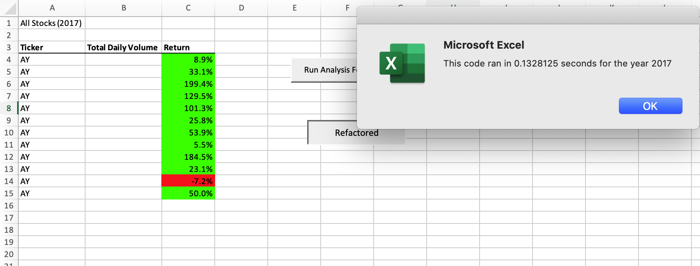
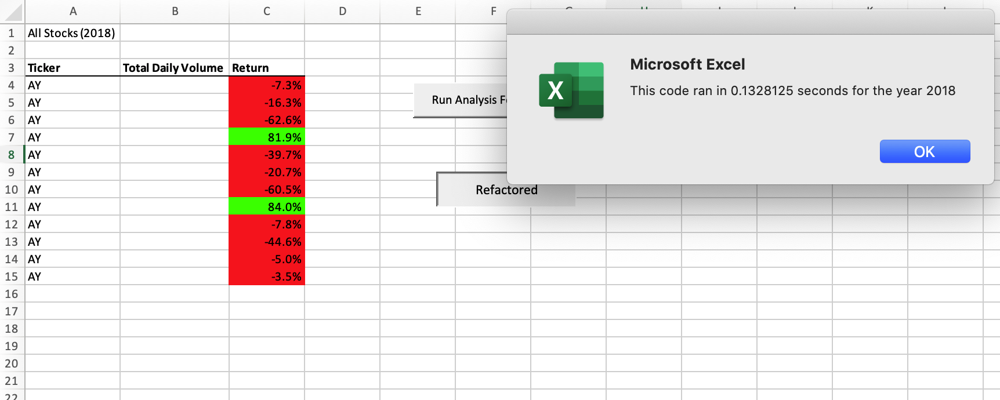

# stock-analysis

## Overview of Project
In this project, we learned how to use VBA in Excel to run a more thorough analysis on the data present in the spreadsheet given, which included data from the last two years on 12 different stocks. The main objective of this specific project was to create simpler, more efficient code so if "Steve" wanted to use the provided macros to run an analysis on the entire stock market, he could do so with less computing power and an overall more efficient macro.

## Results:
When we refactored the code, which is to say we made it more flexible and applicable, we cleaned it up, made it simpler, and cut the processing time immensely. With our original code, the analysis of the year 2017 ran in 0.55 seconds while the year 2018 ran in 0.53 seconds. When we refactored the macro, the cut the times down to 0.12 seconds for 2017 and 0.13 seconds for 2018. This may seem like a small difference but this was a relatively small worksheet. If we were running analysis on the entire stock market, this would cut down on processing time immensely.
 

## Summary: In a summary statement, address the following questions. What are the advantages or disadvantages of refactoring code? How do these pros and cons apply to refactoring the original VBA script?

Refactoring does not include any new functionality or features, but it does speed processes up, makes the code easier to read and maintain, and it can assist in finding bugs.

When refactoring the original VBA script that was provided, we not only made the script easier to work with, but we made it much more efficient in the process. While it was frustrating to spend time refactoring knowing that the overall result and functionality would not change, I can see how it is a useful practice. 
